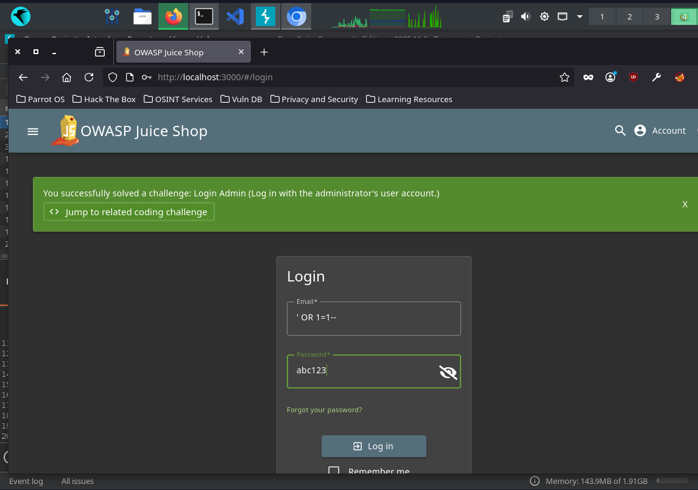
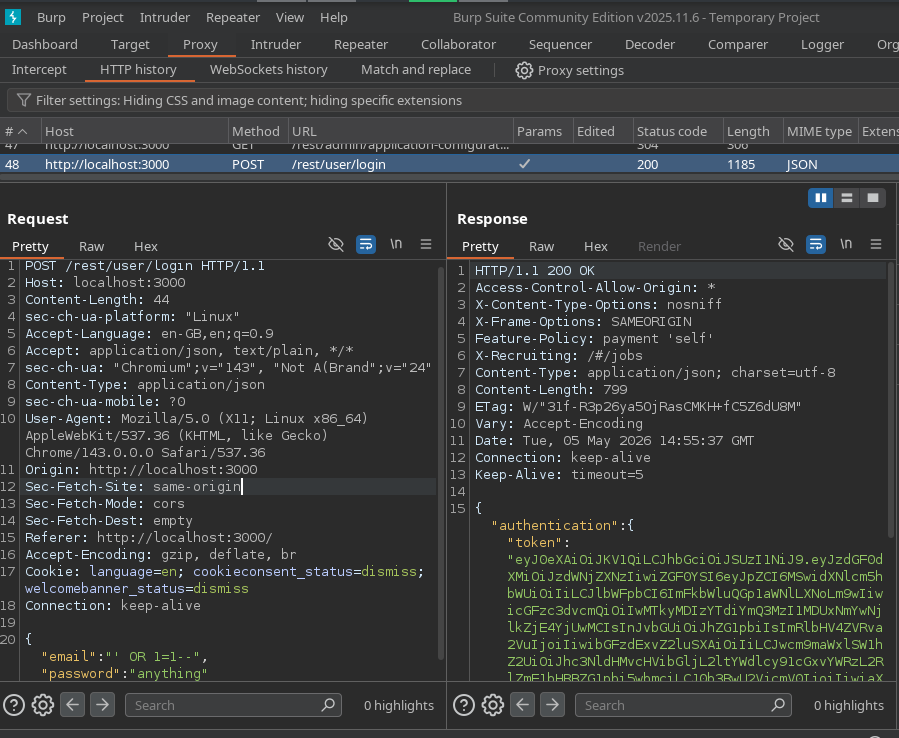
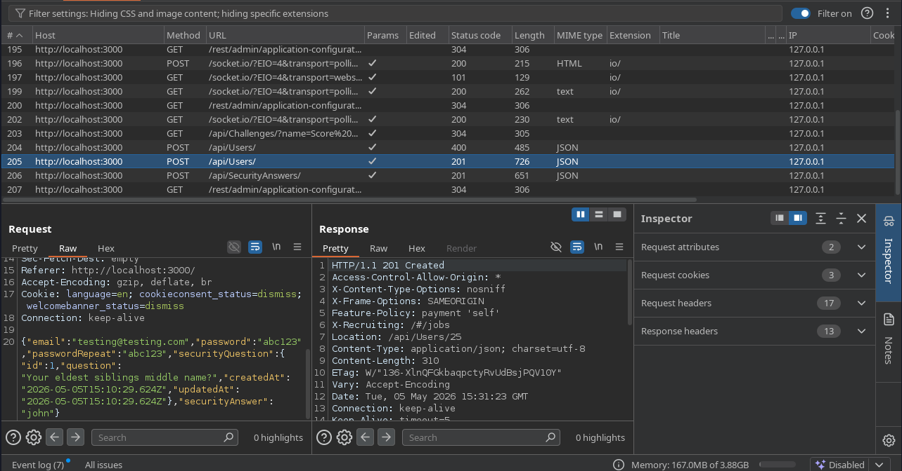
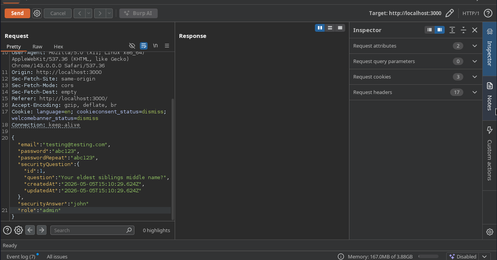
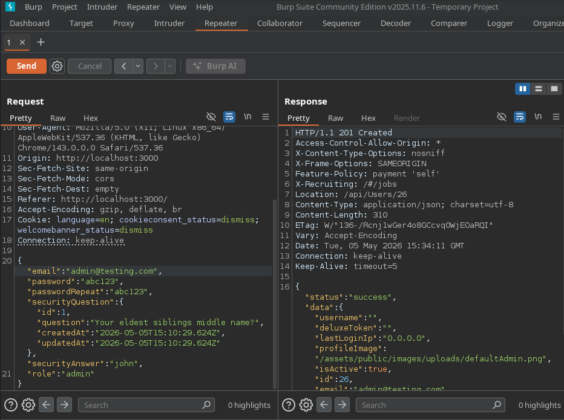
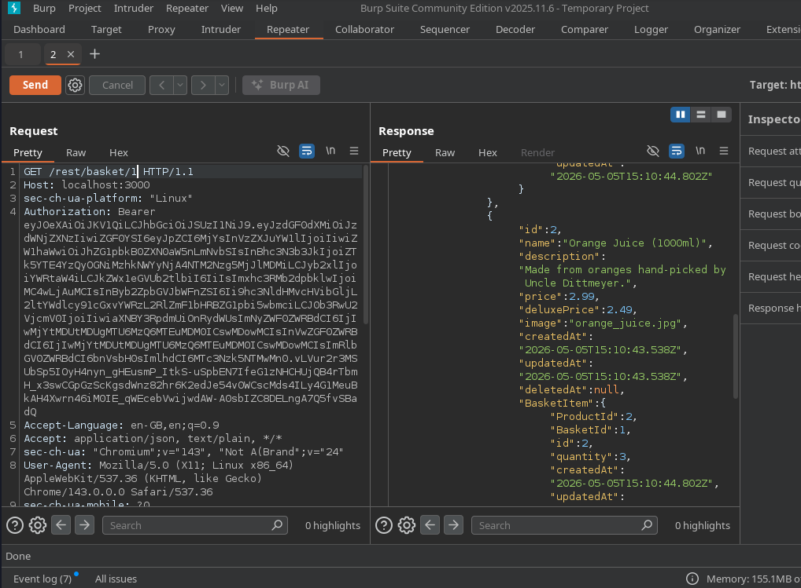
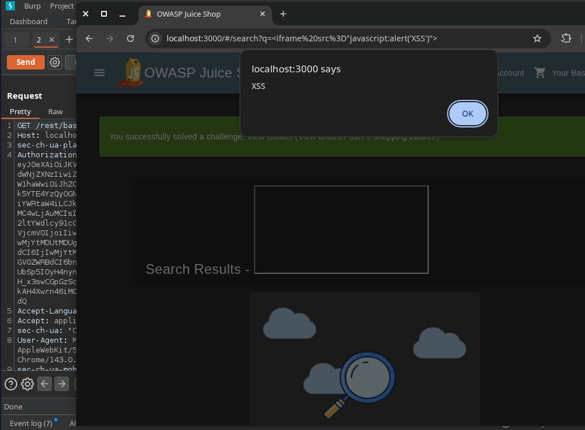

# Web Application & API Penetration Test
**Target:** OWASP Juice Shop  
**Date:** 05 May 2026  
**Tester:** Leonard Iacob  
**Type:** Black box — no prior knowledge of the application  
**Tools:** Burp Suite Community Edition, Chromium  

---

## Overview

Tested the OWASP Juice Shop web application for common vulnerabilities. Found four exploitable issues ranging from authentication bypass to privilege escalation via API manipulation. All four are in the OWASP Top 10.

**Result:** Admin account compromised via SQL injection. Separate admin account created via API mass assignment. Other users' data accessed via IDOR.

---

## Findings Summary

| ID | Title | Type | Severity |
|---|---|---|---|
| FIND-01 | Authentication bypass via SQL injection | SQLi | Critical |
| FIND-02 | Privilege escalation via mass assignment | API Security | Critical |
| FIND-03 | Access to other users' basket data | IDOR | High |
| FIND-04 | Reflected XSS in search field | XSS | High |

---

## FIND-01 — Authentication Bypass via SQL Injection

**Severity:** Critical  
**Endpoint:** `POST /rest/user/login`  
**OWASP:** A03:2021 Injection  

### Steps to Reproduce

Navigated to the login page and entered the following in the email field:

```
' OR 1=1--
```

Password field: any value (e.g. `abc123`).

The application logged in as the admin account without a valid password.





### What Happened

The application built an SQL query that looked like this:

```sql
SELECT * FROM users WHERE email = '' OR 1=1--' AND password = 'abc123'
```

- `' OR 1=1` closes the email string and adds a condition that is always true
- `--` comments out the rest of the query, including the password check
- The database returns the first row — the admin account

### Impact

Any unauthenticated user can log in as admin with no credentials. Full access to all admin functionality, all user data, and all orders.

### Remediation

- Use parameterised queries / prepared statements — never concatenate user input into SQL strings
- Implement a WAF as a secondary control
- Log and alert on repeated login failures

---

## FIND-02 — Privilege Escalation via Mass Assignment

**Severity:** Critical  
**Endpoint:** `POST /api/Users`  
**OWASP:** API3:2023 Broken Object Property Level Authorization  

### Steps to Reproduce

Captured the user registration request in Burp Suite and sent it to Repeater.



The original request body:

```json
{
  "email": "testing@testing.com",
  "password": "abc123",
  "passwordRepeat": "abc123",
  "securityQuestion": { "id": 1, ... },
  "securityAnswer": "john"
}
```

Added `"role":"admin"` to the request body:

```json
{
  "email": "admin2@test.com",
  "password": "abc123",
  "passwordRepeat": "abc123",
  "securityQuestion": { "id": 1, ... },
  "securityAnswer": "john",
  "role": "admin"
}
```



The server responded with `201 Created` and returned `"role":"admin"` in the response body.



Logged in with the new account and navigated to `/#/administration` — full admin panel access confirmed.

### What Happened

The API accepted a `role` field during registration that should not be user-controlled. The backend applied it without validation, creating an admin account through the standard registration flow.

### Impact

Any user can register with admin privileges. No account takeover needed — a fresh registration is enough for full admin access.

### Remediation

- Whitelist only the fields the API should accept — explicitly reject or ignore unexpected fields
- Never derive privilege level from client-supplied data
- Validate and enforce roles server-side at every request

---

## FIND-03 — IDOR: Access to Other Users' Basket Data

**Severity:** High  
**Endpoint:** `GET /rest/basket/{id}`  
**OWASP:** API1:2023 Broken Object Level Authorization  

### Steps to Reproduce

After logging in, browsed to the basket page. Captured the request in Burp:

```
GET /rest/basket/6
```

Sent to Repeater and changed the basket ID from `6` to `1`:

```
GET /rest/basket/1
```



The server returned another user's basket contents with a `200 OK` response.

### What Happened

The API returns basket data based on the ID in the URL without checking whether the authenticated user owns that basket. Any integer can be substituted to access any basket in the system.

### Impact

Exposes all users' basket contents — items, quantities, and any associated personal data. In a real application this could extend to order history, delivery addresses, and payment information.

### Remediation

- Server-side authorisation check on every request — verify the requested resource belongs to the authenticated user before returning data
- Never rely on the client to supply the user ID — derive it from the authenticated session token

---

## FIND-04 — Reflected XSS in Search Field

**Severity:** High  
**Endpoint:** `GET /#/search?q=`  
**OWASP:** A03:2021 Injection  

### Steps to Reproduce

Entered the following in the Juice Shop search bar:

```html
<iframe src="javascript:alert('XSS')">
```

The browser executed the script and displayed an alert dialog.



### What Happened

The application reflects the search query back into the page without sanitising or encoding it. The browser interprets the injected HTML/JavaScript as code and executes it.

### Impact

An attacker can craft a malicious URL containing a script payload and send it to a victim. When clicked, the script runs in the victim's browser in the context of the application. This can be used to:

- Steal session cookies and hijack authenticated sessions
- Redirect users to phishing pages
- Log keystrokes including passwords
- Perform actions on behalf of the victim

### Remediation

- Encode all user-supplied input before rendering it in the browser (HTML entity encoding)
- Implement a Content Security Policy (CSP) header to restrict script execution
- Use a framework that escapes output by default (Angular, React, Vue all do this)
- Set the `HttpOnly` flag on session cookies to prevent JavaScript access

---

## Tools Used

| Tool | Purpose |
|---|---|
| Burp Suite Community Edition | HTTP proxy, request interception, Repeater |
| Chromium (launched via Burp) | Browser with proxy pre-configured |
| OWASP Juice Shop | Deliberately vulnerable target application |
